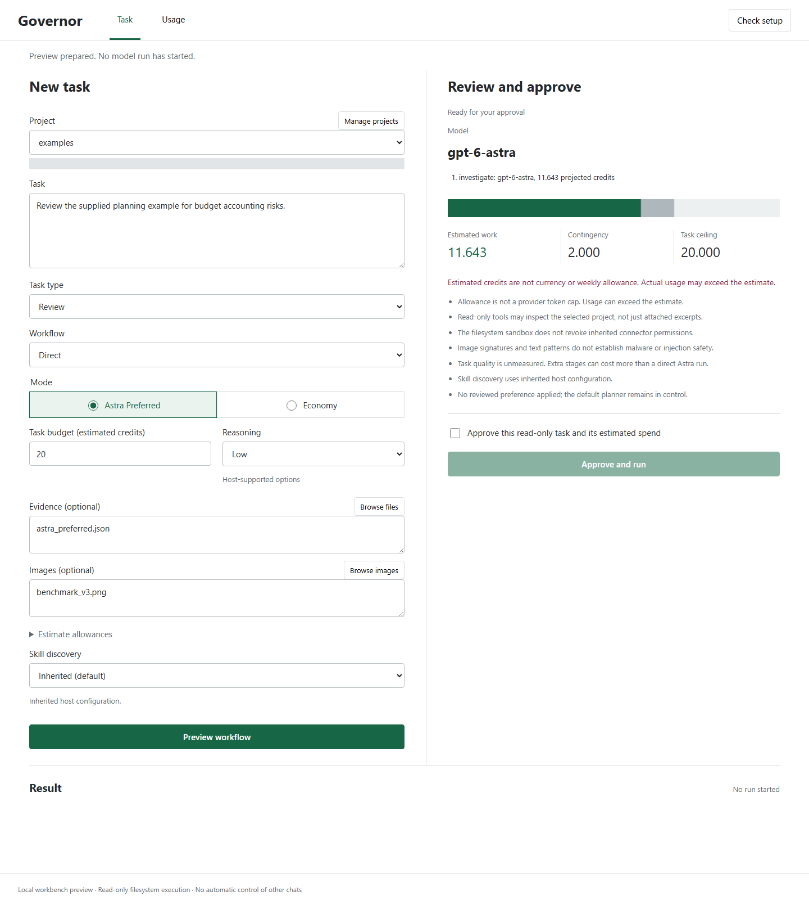

<div align="center">

# Premium Model Budget Governor

**Keep Astra in the workflow. Make unnecessary spend visible.**

A local workbench, CLI, and MCP server for planning premium-model work,
approving estimated spend, and inspecting usage afterward.

[](https://github.com/sulabhdubey/premium-model-budget-governor/actions/workflows/ci.yml)
[](https://github.com/sulabhdubey/premium-model-budget-governor/releases/tag/v0.4.0-rc.5)
[](LICENSE)


**[Explore the demo](https://sulabhdubey.github.io/premium-model-budget-governor/)**
&nbsp; / &nbsp; **[Install the beta](#install)**
&nbsp; / &nbsp; **[Connect MCP](docs/MCP.md)**
&nbsp; / &nbsp; **[Become a tester](#help-test-the-beta)**

</div>



*Actual development Workbench capture, not a generated mockup. A preview does not start a model call.*

> **Public beta, not a stable release.** The downloadable version is `0.4.0rc5`.
> Execution is currently read-only and requires your explicit approval.
> This does not change the active model in existing Codex chats, make tokens
> cheaper, or guarantee the same quality at lower cost.

## Why This Exists

One weekly Codex allowance was consumed in roughly a day of Astra-heavy work.
After a reset, only about 16% of the second allowance remained the following day.
These were Sulabh Dubey's observed account readings, not a controlled benchmark.

The goal was **not to stop using Astra**. It was to keep its capabilities available
without spending unnecessarily on repeated context, oversized evidence, and
extra model handoffs.

That distinction shapes this project: **direct Astra is the default**. A cheaper
model is an option, not the product's answer to every task. Hybrid workflows
must account for all their stages, not just their cheapest step.

**Idea, research guidance, and product management: Sulabh Dubey.**
Research synthesis, design, engineering, testing, documentation, and release
execution: Codex by OpenAI, under his direction.
[Origin and credits](docs/ORIGIN_AND_CREDITS.md).

## What You Can Do

| Your question | What the governor provides |
| --- | --- |
| Can Astra handle this directly? | Astra-preferred planning with capability checks; no mandatory Sol-first attempt |
| What am I approving? | A task preview with selected evidence, workflow stages, and estimated credits |
| Would a hybrid actually help? | Whole-workflow estimates including preparation, execution, verification, and contingency |
| What did the run consume? | Recorded input, cached-input, and output counts where available, plus token-rate cost estimates |
| What happens if usage is unknown? | Unresolved spend stays reserved; it is not silently refunded or treated as zero |
| Can my agent use it? | An optional local MCP server and a Codex plugin bundle |

### One Task, One Visible Decision

1. **Choose** a project and describe a small task. Add the relevant files or images.
2. **Preview** a direct Astra run, or explicitly select a supported multi-stage workflow.
3. **Approve** the proposed read-only execution after checking the estimate.
4. **Inspect** the result and usage receipt. Compare the complete cost, not a capsule alone.

The Workbench supports project management, evidence selection, stop/reconnect,
and receipt inspection without writing JSON. Initial installation still uses a
terminal. Human usability testing is open; we are not claiming anyone can install
it effortlessly yet. [Workbench guide](docs/WORKBENCH.md).

## Install

**You need:** Python 3.10+ and, for real execution, an installed and authenticated
Codex CLI with access to the requested model. Model calls use your account's
capacity. The [web demo](https://sulabhdubey.github.io/premium-model-budget-governor/)
is illustrative and does not run models.

### 1. Download The Beta

Get these files from the [rc.5 release](https://github.com/sulabhdubey/premium-model-budget-governor/releases/tag/v0.4.0-rc.5):

- [Installer](https://github.com/sulabhdubey/premium-model-budget-governor/releases/download/v0.4.0-rc.5/install_governor.py)
- [Python wheel](https://github.com/sulabhdubey/premium-model-budget-governor/releases/download/v0.4.0-rc.5/premium_model_budget_governor-0.4.0rc5-py3-none-any.whl)
- [SHA-256 checksums](https://github.com/sulabhdubey/premium-model-budget-governor/releases/download/v0.4.0-rc.5/SHA256SUMS.txt)

Keep the installer and wheel in the same folder. Check the downloaded files
against the release checksums before installing; only install code you trust.

### 2. Preview, Then Install

Open a terminal in that folder. The first command previews; the second installs:

```sh
python install_governor.py install --wheel premium_model_budget_governor-0.4.0rc5-py3-none-any.whl
python install_governor.py install --wheel premium_model_budget_governor-0.4.0rc5-py3-none-any.whl --yes
```

This creates a dedicated environment at `~/.pm-bg/runtime`. It does not change
your Codex settings, PATH, or other Python environments, and does not run a model.
If that folder already exists, follow the [upgrade/removal guidance](docs/INSTALLATION.md)
instead of overwriting it. Keep projects and ledgers outside the runtime folder.

### 3. Check Setup And Open The Workbench

**Windows PowerShell** (replace the example project folder):

```powershell
& "$HOME/.pm-bg/runtime/Scripts/pm-bg.exe" doctor
& "$HOME/.pm-bg/runtime/Scripts/pm-bg.exe" serve --project "C:\path\to\project"
```

**Linux / macOS shell** (replace the example project folder):

```sh
"$HOME/.pm-bg/runtime/bin/pm-bg" doctor
"$HOME/.pm-bg/runtime/bin/pm-bg" serve --project "/absolute/path/to/project"
```

The server opens a private local browser link. Do not share that session link.
`doctor` checks setup without starting a model call; it does not prove model
access or remaining capacity. The released wheel has local Windows and Ubuntu/WSL
qualification; native macOS interactive usability is not established.

**Need help?** [Installation and recovery](docs/INSTALLATION.md) / [FAQ](docs/FAQ.md)

<details>
<summary><strong>Developers: source install and a no-model planning example</strong></summary>

Use a dedicated environment for development:

```sh
git clone --branch v0.4.0-rc.5 https://github.com/sulabhdubey/premium-model-budget-governor.git
cd premium-model-budget-governor
python -m venv .venv
```

Activate it with `.venv\Scripts\Activate.ps1` on Windows PowerShell, or
`source .venv/bin/activate` on Linux/macOS, then:

```sh
python -m pip install -e ".[dev]"
pm-bg plan --input examples/astra_preferred.json
python -m pytest
```

The example is illustrative: it plans but does not execute a model. Replace its
estimates and approval state with real task inputs before using it for a decision.
See [the planning contract](docs/ASTRA_PREFERRED.md) and [CLI quickstart](docs/QUICKSTART.md).

</details>

## Use It With Codex Or MCP

The Workbench is one entry point. Compatible agents can also call local tools
such as `plan_model_workflow`, `manage_task_budget`, and `build_capsule_from_files`.

| Integration | Start here |
| --- | --- |
| Local MCP server | [Install optional dependencies and configure your client](docs/MCP.md) |
| Codex plugin | [Setup guide](docs/CODEX_SETUP.md) and [downloadable plugin bundle](https://github.com/sulabhdubey/premium-model-budget-governor/releases/download/v0.4.0-rc.5/premium-model-budget-governor-plugin-0.4.0-rc.5.zip) |
| Governed read-only execution | [Host integration and approval boundaries](docs/HOST_INTEGRATION.md) |

Adding MCP exposes tools; it does not force an agent to use them or automatically
govern every existing chat. The integration guide uses an explicit runtime path
so the client does not accidentally launch a different Python installation.

## What The Tests Actually Show

**We publish the cases that did not save money, too.**

| Evidence | Observation | Boundary |
| --- | --- | --- |
| rc.5 installed-wheel qualification | 334 tests passed, one skipped on both Windows and Ubuntu/WSL; real MCP stdio checks and owned uninstall passed | Software regression evidence, not human usability or model-quality proof |
| One real Astra Workbench run | 24,076 input tokens, 386 output tokens, 21.3 seconds | Demonstrates execution; not a matched savings comparison |
| Expanded pilot: 39 worker calls | Five task families across four workflows; extra handoffs usually cost more than direct Astra | Limited development experiments, graded by Codex rather than independent evaluators |
| Four-call focused-catalog experiment | About 17% lower mean token-rate-estimated cost on one repeated visual task | May omit useful skill guidance; not general quality equivalence or weekly savings |

**Read the evidence:** [Release qualification](docs/RELEASE_CANDIDATE_RC5.md) /
[Real execution receipt](artifacts/approved-astra-ui-smoke-2026-09-07.md) /
[Pilot, methods, and negative findings](docs/FIELD_TRIAL_2026_09_07.md) /
[Focused-catalog tradeoffs](docs/FOCUSED_CATALOG.md).

Token-rate-estimated credits are **not provider billing records or weekly-limit
percentages**. Independent held-out task evaluation and technical/nontechnical
onboarding sessions remain open. We will not convert these early observations
into a blanket "same Astra quality for less" claim.

## Controls, Not Magic

- **Whole-task budgets:** persistent reservations, expiring leases, and replay protection for cooperating runners.
- **Evidence preparation:** explicit file selection, capsule scoring, and graph summaries; required evidence must not silently disappear.
- **Usage recovery:** reconcile a recorded terminal receipt without rerunning a paid task; missing usage remains unknown.
- **Reviewed preferences:** inspect evidence-based proposals, activate manually, and roll back. No automatic policy promotion is claimed.
- **Publication checks:** bounded pattern scanning for secrets and private terms, with hash-bound reports and manual-review states.

See [capability controls](docs/CAPABILITY_CONTROLS.md), [architecture](docs/ARCHITECTURE.md),
and [publication privacy](docs/PUBLICATION_PRIVACY.md) for the contracts.

### Know The Boundaries

- Read-only execution does **not** revoke inherited connector permissions.
- Estimates and local admission checks are **not** a provider-enforced in-flight spending cap.
- Secret and prompt-injection scans are supplementary checks, **not** antivirus or a security guarantee.
- Desktop-only actions and unsupported capabilities must be reported, not silently replaced.
- Smaller context can remove useful guidance; focused discovery stays opt-in.
- Nothing here bypasses provider limits or guarantees identical output quality.

Report sensitive findings through [SECURITY.md](SECURITY.md), not a public issue.
Cloned before the privacy cleanup? Read [history migration](docs/HISTORY_MIGRATION.md)
before contributing; do not merge the old history back.

## Help Test The Beta

**We are looking for technical and nontechnical testers, and creators who want
to evaluate it independently.** No endorsement or positive result is expected.

1. Try installation and one small, non-sensitive, read-only task.
2. Record where you got stuck, what worked, and whether the answer was useful.
3. [Submit a beta trial report](https://github.com/sulabhdubey/premium-model-budget-governor/issues/new?template=onboarding_trial.md).

Never post credentials, private project files, prompts, or local session links.
Review any attachments before sharing. A failed installation or a more expensive
workflow is useful feedback, not a result to hide.

For a cost comparison, use the [independent validation protocol](docs/INDEPENDENT_VALIDATION.md):
freeze the task and quality criteria first, assess answers before revealing
costs, and count every stage, failure, and retry. Model calls consume your own
capacity; no paid comparison is required just to report onboarding feedback.

[Onboarding protocol](docs/ONBOARDING_TRIAL.md) / [Contributing](CONTRIBUTING.md) /
[Creator testing brief](docs/OUTREACH_KIT.md)

## Free, Open Source, Independently Built

The published code is available under [Apache-2.0](LICENSE). There is no paid
unlock required for the features in this repository; your model-provider usage
remains separate. Possible future paid additions are a [roadmap discussion](docs/OPEN_CORE.md),
not a currently shipping Pro product.

This is an independent project, not an OpenAI product or endorsed by OpenAI.

**[Try the beta](#install). [Share what happened](#help-test-the-beta). Help us measure where it really helps.**
